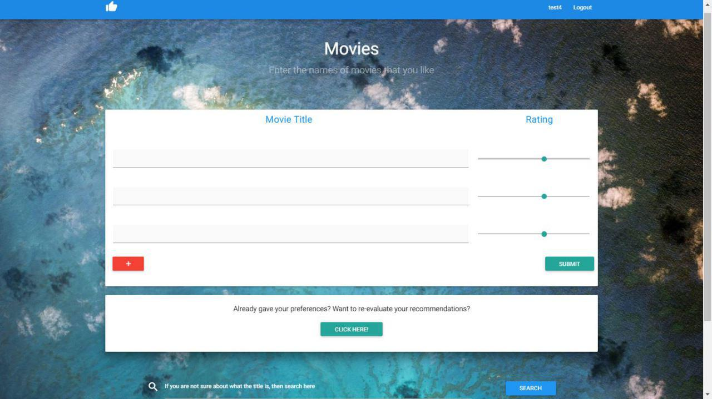
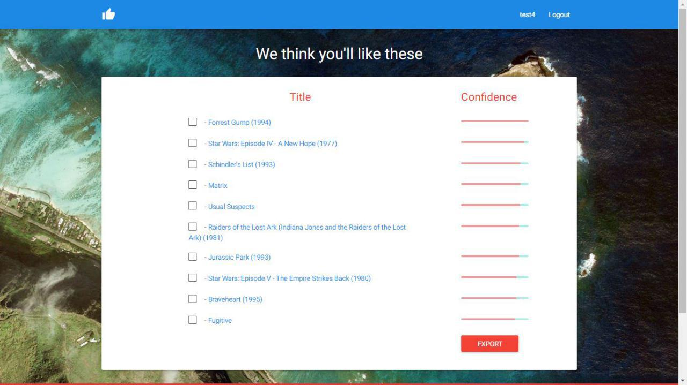

# Recommendation System

#### Feature-Adaptive Recommendation System. 
#### Analyzing dataset of 500,000 user preferences and popular activity in Music, Movies and Books to make recommendations through a variation on the collaborative filtering, written entirely in SQL Queries.

- The System User will be asked to provide basic information about his/her preferences in multiple user-feature categories and subsequently provided with recommendations on the same features based on the his/her seed input.

- The system learns from the user’s observed choices over time, and optimizes its recommendations further.

## Machine Learning:

The Algorithm is heavily inspired from the popular document retreival algorithms & the Collaborative Filtering algorithm used today in ML, but is modified and optimized further, having been written completely in SQL Queries* .

The retreival of the K-Nearest Neighbours of the given System user allows us to answer who the other 'closest' users are to the current user in terms of his/her preferences, and we simply recommend their top rated choices.

The Queries are implemented within the Java Servlets.

## Recommender Algorithm written completely in SQL Query: 

The Algorithm is heavily inspired from the popular document retreival algorithms used today in ML, but is modified and optimized further, having been written completely in SQL Queries* .

    -- SQL Query for recommending movies to a user, 
    
    -- START --
    with c_user as (select movie_id,rating from user_movie      
                where user_id=?),       --ratings are in the range: [-5,5]. 
            
         ranks as (select um.user_id,x.movie_id,(10 - ABS(x.rating-um.rating)) as rank   
				   from c_user x, user_movie um where um.movie_id in
				   (select movie_id from c_user)),     -- Measures difference in ratings of the current user & other users

         bonds as (select user_id, sum(rank) as bond 
				   from ranks
				   group by user_id),       -- 'Bond' here is thus a measure of user-similarity based on similar movie-ratings

         r_pool as (select movie_id, rating*bond as rating007   
					from user_movie natural join bonds
					where movie_id not in
					(select movie_id from c_user)), -- 'Rating007' weights each movie as the confidence of the recommendation (the user's bond) * it's ratings
			  
	 d_pool as (select movie_id,avg(rating007) as final_score   -- Averages the weights for the movies
	    				from r_pool group by movie_id)
	
	 select title,final_score 
	 from d_pool natural join movie 
         order by final_score desc      -- Orders the Movies from most highly recommended to least recommended movies.
         
    -- END --

## GUI Structure:

Client Side & Front End: HTML, XML, JavaScript & CSS.

Server-Side: Java Servlet servicing User Requests and accessing Oracle Database using a JDBC Connection. 
    
Database (Currently Local): Oracle 11g XE

> Database ER Diagram

> Index page:  

> Index Page (Cont. Scroll): 

> Content Page :

> Create Account Page :

> Recommendations Result Page :

